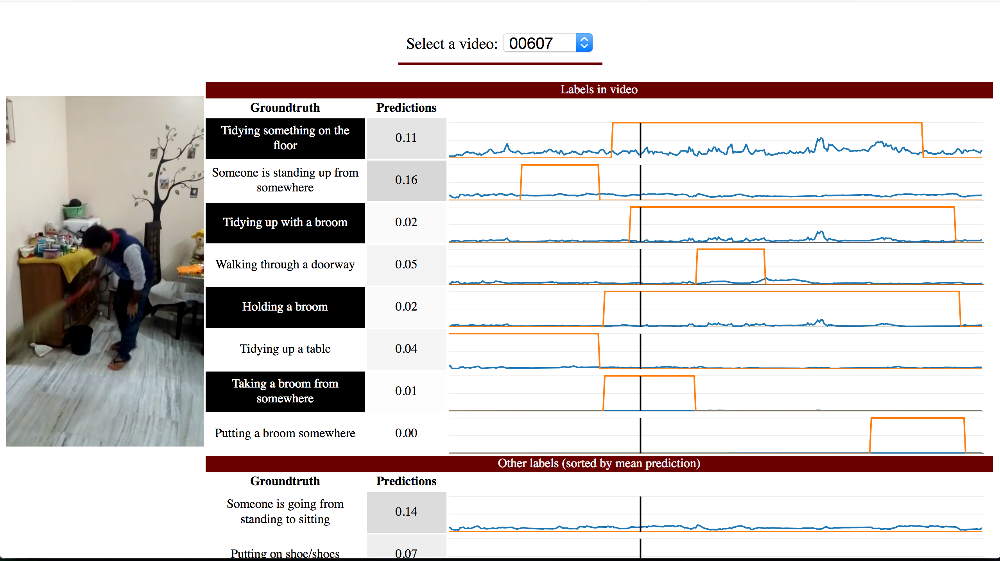

# Video Predictions Visualizer

A relatively bare-bones interface for visualizing per-frame predictions and
groundtruth labels on video data.

*Click to play*

[](screenshots/video-visualizer-example.mp4)

## Usage

Since everyone stores their predictions and groundtruth in a variety of formats,
you'll need to write some code to allow the visualizer to access your data.

The basic steps are:

1. Implement a DataLoader which implements the abstract methods in
   [`data_loaders/data_loader.py`](data_loaders/data_loader.py). Here's an
   [example](data_loaders/multithumos.py) that I wrote and is used for the demo
   above.
2. "Register" your DataLoader
   [`data_loaders/__init__.py`](data_loaders/__init__.py), similar to how
   the `MultiThumosDataLoader` is, currently.
3. Create a `.cfg` file for your data loader, similar to
   [`video_visualizer.cfg`](video_visualizer.cfg). Note that the
   `DATA_LOADER_CONFIG` config option will be passed as keyword arguments to
   your `DataLoader`.

Finally, you can run the server!

````bash
export FLASK_APP=video_visualizer.py FLASK_CONFIG=video_visualizer.cfg
flask run
````
